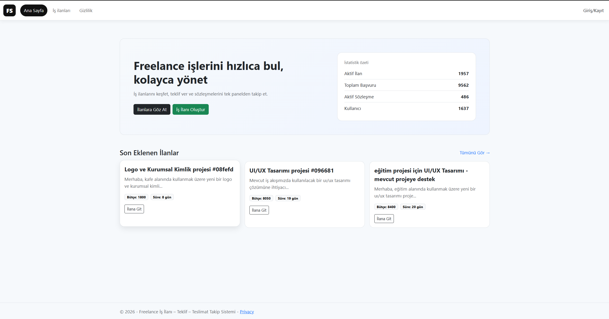
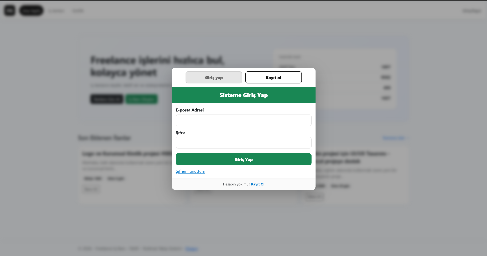
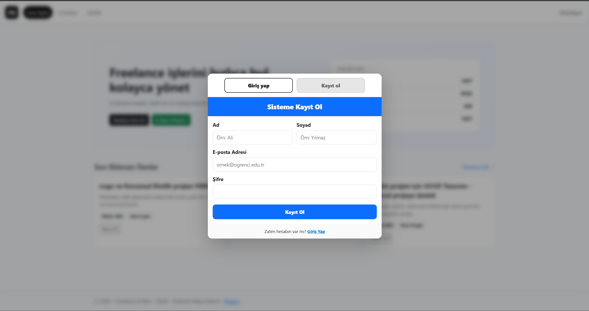
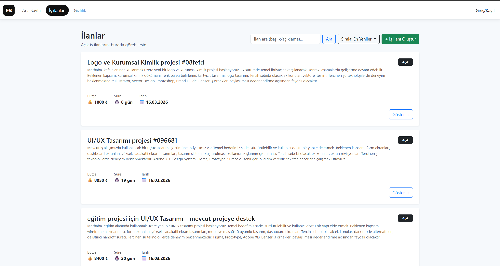
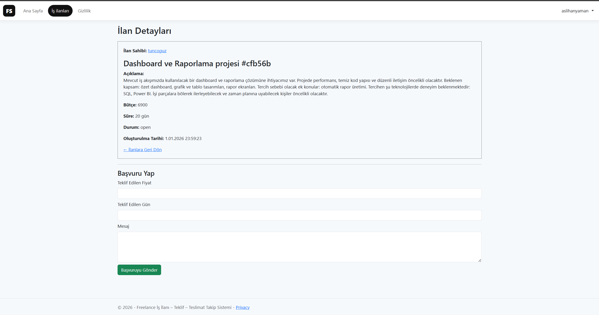
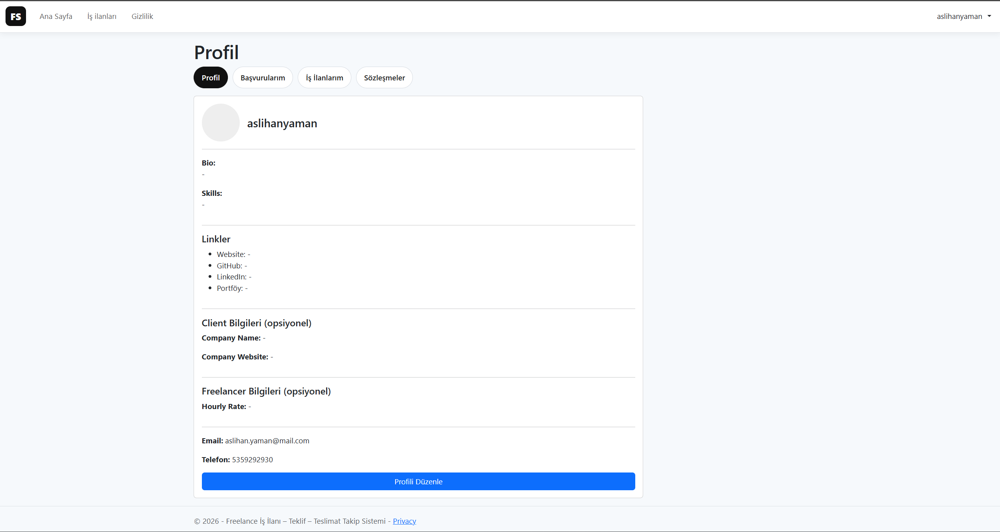
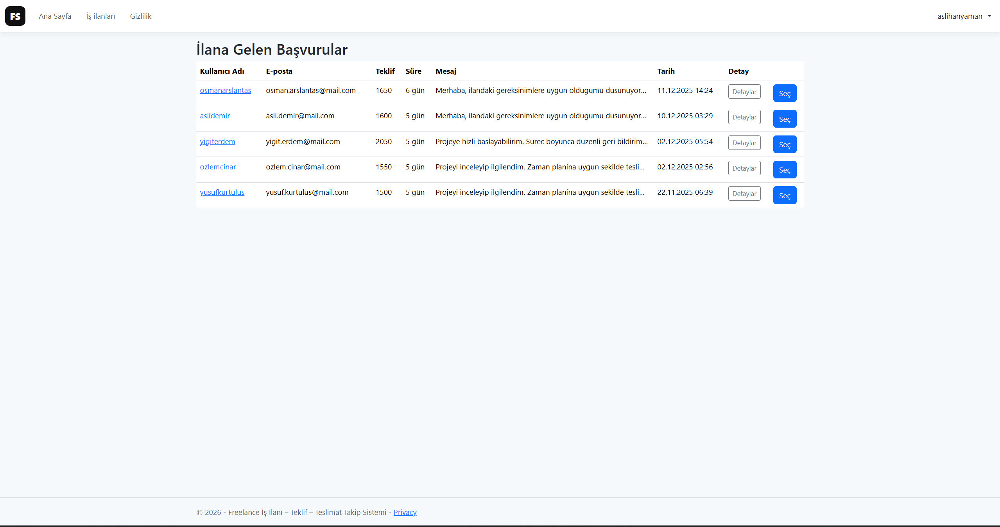
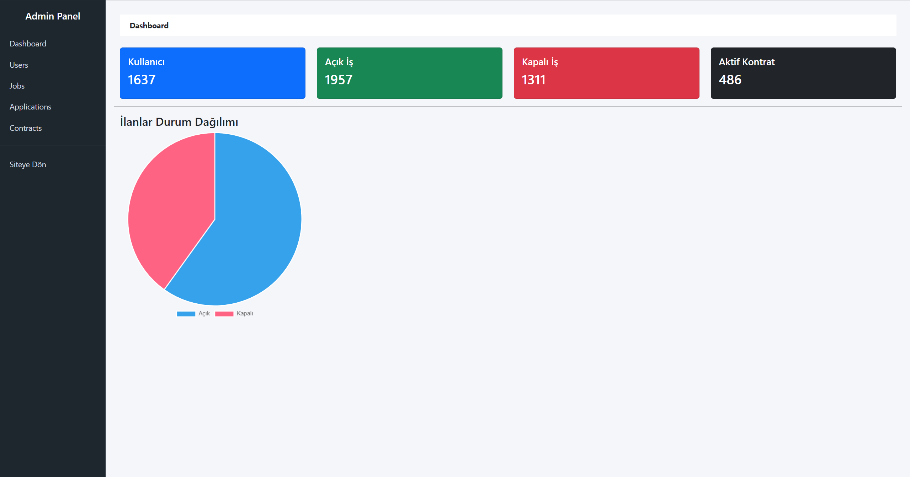

# 🚀 Freelance Job Platform

A full-stack freelance job platform where clients can post jobs, freelancers can apply, and contracts can be managed end-to-end.

---

## 📌 Description

This project is a freelance marketplace system that enables:

* Clients to create and manage job postings
* Freelancers to browse jobs and submit proposals
* Contract creation and delivery tracking
* Admin panel for system monitoring and management

The platform simulates a real-world freelance ecosystem with role-based access and complete workflow handling.

---

## 🛠️ Tech Stack

* **Backend:** ASP.NET Core
* **Frontend:** Razor Pages / MVC
* **Database:** MySQL
* **ORM:** Entity Framework Core
* **Authentication:** Cookie-based Authentication

---

## ✨ Features

### 👤 User Features

* User registration & login
* Profile management
* Browse job listings
* Apply to jobs
* Track applications

### 🧑‍💼 Client Features

* Create job postings
* View applicants
* Manage contracts

### 🛡️ Admin Panel

* Dashboard with statistics
* User management
* Job & application control
* Contract tracking

---

## 🧪 Demo Data

The database is automatically populated using a **data generator**.
This allows testing the system with realistic sample data such as users, jobs, applications, and contracts.

---

## 🔐 Admin Access

Use the following credentials to access the admin panel:

```
Email: admin@admin
Password: admin
```

---

## 📸 Screenshots

### Home Page



### Login



### Register



### Jobs



### Job Detail



### Profile



### Applications



### Admin Panel



---

## ⚙️ Installation

1. Clone the repository:

```
git clone https://github.com/Elnur-Azizov/freelance-job-platform.git
```

2. Configure the database connection in `appsettings.json`

3. Run database migrations:

```
dotnet ef database update
```

4. Run the project:

```
dotnet run
```

---

## 📈 Future Improvements

* Real-time messaging system
* Payment integration
* Notification system
* Advanced filtering & search

---

## 👨‍💻 Author

**Elnur Azizov**
